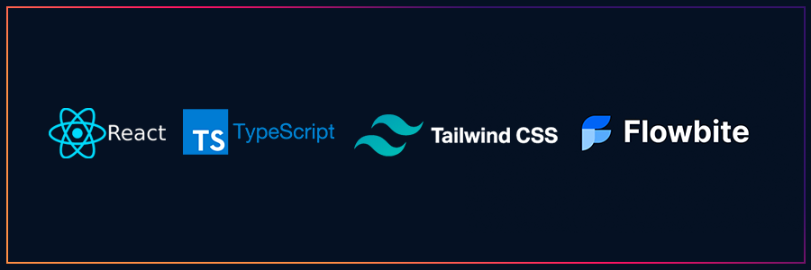

<div align="center">
  <p align="center">
    
  </p>
 <h1>React TS Flowbite</h1>
 <h3>Projeto Reactjs Typescript para início de aplicação com Tailwind CSS e o tema Flowbite<h3>
</div>


### 1. `Criação do Projeto`
```
$ npx create-react-app react-ts-tailwind-flowbite --template=typescript
```

### 2. `Instalando Tailwind`
```
$ npm install -D tailwindcss postcss autoprefixer
```

### 3. `Iniciando Tailwind`
```
$ npx tailwindcss init -p
```

### 4. `Adicionar na pasta tailwind.config.js`
```
 content: [
    "./src/**/*.{js,jsx,ts,tsx}",
  ],
```

### 5. `Alterar arquivo ./src/index.css para`
```
@tailwind base;
@tailwind components;
@tailwind utilities;
```

### 6. `Instalar Flowbite`
```
$ npm i flowbite flowbite-react
```

### 7. `No arquivo tailwind.config.js adicionar o tema Flowbite como plugin`
```
plugins: [
        require('flowbite/plugin')
    ]
```
